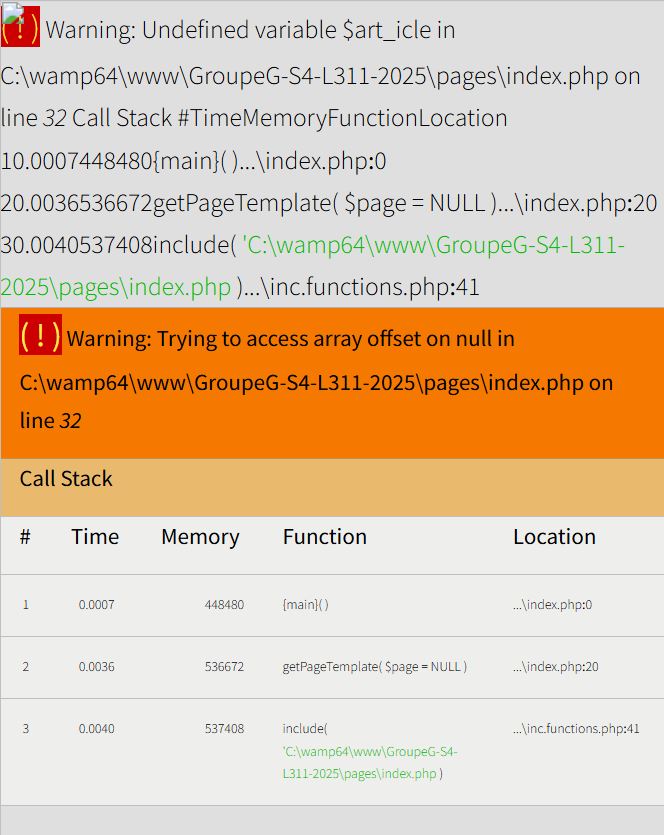
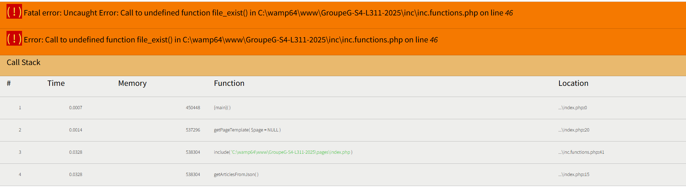
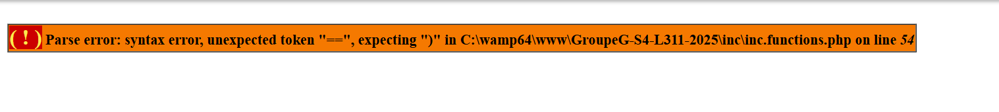
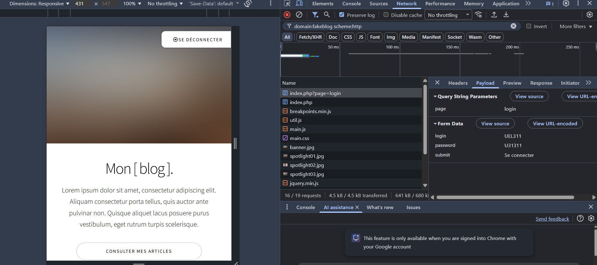
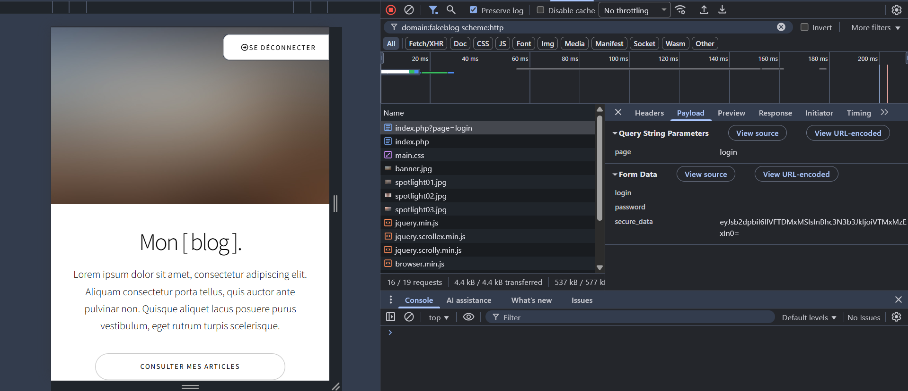

# Simple and minimalist fake blog - UE L311 - Semaine 4 - Groupe G

## 📚 Sommaire

- 👥 [Membres du groupe](#membres-du-groupe)
- 🎯 [Objectifs](#objectifs)
- 🤝 [Travail collaboratif](#travail-collaboratif)
  - 🛠️ [Outils](#outils)
  - 📋 [Principe général](#principe-général)
- 🗓️ [Planning de la semaine](#planning-de-la-semaine)
- 🐞 [Méthodes de débogage](#méthodes-de-débogage)
- 🗃️ [Typologie des erreurs](#typologie-des-erreurs)
  - 📄 [Fichiers](#fichiers)
  - 🧩 [Syntaxe](#syntaxe)
  - 🔡 [Typographie](#typographie)
  - 📐 [Logique](#logique)
  - 🔐 [Sécurité](#sécurité)
- 🧪 [Tests fonctionnels manuels](#tests-fonctionnels-manuels)
- 📈 [Bilan](#bilan)

## Membres du groupe

| Etudiant.e  |   Alias    |     Branche     | Déployé sur |
| :---------: | :--------: | :-------------: | :-------------: |
| Mathilde C. | Clouddy23  | bugfix/mathilde |                 |
|   Kamo G.   | Spaghette5 |   bugfix/kamo   |                 |
| Mathieu L.  |  mathleys  | bugfix/mathieu  |                 |
| Filippos K. |  filkat34  | bugfix/filippos | [https://katsanos1.hosting.unilim.fr/git/GroupeG-S4-L311-2025/index.php](https://katsanos1.hosting.unilim.fr/git/GroupeG-S4-L311-2025/index.php)|

## Objectifs

- [x] Mobiliser les méthodes de déboggage de code PHP abordées en classe virtuelle pour rendre le site d'un blog fonctionnel.
- [x] Savoir utiliser le client git et la plateforme Github en vue de collaborer au sein d'une équipe de développement.

## Travail collaboratif

### Outils

Le principal outil de collaboration utilisé est Github. Nous avons cloné le dépôt fourni et chaque membre de l'équipe a créé sa propre branche pour pouvoir travailler indépendamment. Nous avons également utilisé Teams pour faire une visio de code review.

### Principe général

Le projet a été cloné sur un dépôt public github. Chaque membre a créé sa branche, procédé aux corrections jugées nécessaires sur celle-ci avant de faire une demande de tirage. Une visio de "Code review" est prévue en fin de semaine afin d'échanger autour des problèmes identifiés, corriger et harmoniser les approches.

## Planning de la semaine

| Dates       | Objectif                                                                                                                                                          |
| :---------- | :---------------------------------------------------------------------------------------------------------------------------------------------------------------- |
| 20/10-24/10 | **Période de débogage** dans la branche de chaque développeur : _bugfix/nomdudev_                                                                                 |
| 24/10       | **Code review en visio** pour discussion autour des pull requests, merge dans main et **finalisation de la rédaction du CR** dans le README.md de la branche main |

## Méthodes de débogage

Pour identifier et corriger les problèmes, plusieurs méthodes de debug ont été employées.

### Xdebug
L'essentiel des bugs a été identifié grâce à l'outil _Xdebug_ qui fournit des informations très précises sur l'origine des erreurs. Ci-dessous, un rapide tuto pour la mise en place de _Xdebug_ sur l'environnement docker puis, à titre d'exemples quelques captures d'écran concernant trois types d'erreurs différents.

#### Mise en place de Xdebug sur la pile LAMP de l'environnement docker (Hosting)

##### Installation
`apt-get install php-xdebug`

##### Création d'une page d'informations sur Xdebug
Création d'un fichier `xdebug_info.php` dans lequel il faut appeler la fonction `xdebug_info();` pour afficher les informations.

Une fois sur cette page, le diagnostic indique une erreur de configuration du port d'écoute (par défaut à 9003 inexistant sur la configuration docker donnée).

##### Trouver le chemin vers le fichier xdebug.ini

`php --ini` puis repérer le chemin vers xdebug.ini (normalement `/etc/php/8.1/cli/conf.d/20-xdebug.ini`)

##### Trouver les adresses et ports d'apache sur la configuration hosting

`ss -tunlp` puis repérer l'adresse(127.0.0.11) et le port (80) du serveur apache

##### Modifier le fichier _xdebug.ini_ en fonction

`nano /etc/php/8.1/cli/conf.d/20-xdebug.ini` puis dans le fichier renseigner l'adresse et le port du serveur apache :
`zend_extension=xdebug.so
xdebug.mode=develop
xdebug.start_with_request=yes
xdebug.client_port=80
xdebug.client_host=127.0.0.11`

#### Exemples de bugs identifiés par _Xdebug_
##### Une coquille sur le nom d'une variable

##### Une coquille dans le nom d'une fonction lors de son appel

##### Une erreur de syntaxe confondant assignation et comparaison de variables

### Affichage des erreurs dans le navigateur et journalisation des logs

L’affichage des erreurs et la journalisation des logs ont été configurés à deux niveaux complémentaires. D’une part, via le php.ini, pour une capture et un affichage des erreurs sur l’ensemble de l’environnement. D’autre part, de manière locale directement dans les scripts PHP à l’aide de ini_set et error_log (tracage ciblé des logs et centralisation dans un fichier php_error.log).

### Configuration globale via le php.ini

### Configuration locale du projet directement dans les scripts php

### Inspecteur du navigateur

L'inspecteur du navigateur est toujours une référence précieuse lors des séances de débogage. Il a par exemple révélé une faille de sécurité majeure : le login et mot de passe sont transmis en clair vers le serveur, ce qui rend possible leur interception.

## Typologie des erreurs

Nous avons établi ci-dessous une typologie des erreurs trouvées avec quelques exemples pour chacune d'entre elles. Il s'agit bien d'une typologie et non d'une liste exhaustive de toutes les erreurs corrigées.

### Fichiers

| Bug                                                     | Correction                                            | Explication                                                                                             |
| :------------------------------------------------------ | :---------------------------------------------------- | :------------------------------------------------------------------------------------------------------ |
| `define('DB_ARTICLES', TL_ROOT.'/dbal/articles.json');` | `define('DB_ARTICLES', TL_ROOT.'/db/articles.json');` | Correction du chemin de dossier de _/dbal/_ vers _db_ pour correspondre à la structure réelle du projet |
| ` include 'inc/tpls-footer.php';`                       | ` include 'inc/tpl-footer.php'`                       | Correction du nom de fichier (suppression du 's')                                                       |
| `header('Location:indx.php') `                          | `header('Location:index.php')`                        | Correction du nom du fichier (ajout du 'e')                                                             |

### Syntaxe

| Bug                                            | Correction                                     | Explication                                                       |
| :--------------------------------------------- | :--------------------------------------------- | :---------------------------------------------------------------- |
| `function getArticleById($id_article == null)` | ` function getArticleById($id_article = null)` | Remplacement de l'opérateur de comparaison == par l'assignation = |
| `##$compteur++; `                              | ` $compteur++;`                                | Suppression du commentaire empêchant l’exécution du code          |

### Typographie

Les erreurs typographiques (fautes de frappe) ont été les plus nombreuses. Parmi celles-ci, on retrouve surtout des coquilles dans les noms des variables et des fonctions.

| Bug                                                     | Correction                                             | Explication                                                                          |
| :------------------------------------------------------ | :----------------------------------------------------- | :----------------------------------------------------------------------------------- |
| `<?php includ 'inc/inc.functions.php'; ?> `             | ` <?php include 'inc/inc.functions.php'; ?>`           | Ajout du _e_ à _include_                                                             |
| ` if($_SERVER["RQUEST_METHOD"] == "POST"`               | ` if($_SERVER["REQUEST_METHOD"] == "POST")`            | Correction du nom de la variable superglobale (ajout du _e_ à _REQUEST_              |
| ` sessions_destroy()`                                   | ` session_destroy()`                                   | Rectification de la faute de frappe dans l’appel de la fonction (suppression du _s_) |
| `" alt="" />` | `" alt="" />` | Correction du nom de la variable (suppression du \_ )                                |

### Logique

| Bug                                                | Correction                                          | Explication                                                                                                                   |
| :------------------------------------------------- | :-------------------------------------------------- | :---------------------------------------------------------------------------------------------------------------------------- |
| `if(is_null($article) OR !!!!count($article))`     | `if(is_null($article) OR !count($article))`         | Simplification de la quadruple négation !!!! qui vaut affirmation en simple négation                                          |
| ` connectUser($_GET['login'], $_POST['password'])` | ` connectUser($_POST['login'], $_POST['password'])` | Correction de GET en POST car il s’agit d’envoyer des données vers le serveur pour vérifier si les identifiants sont corrects |

### Sécurité

| Bug                                                       | Correction                                                                                                                                                                                                                                                                     | Explication                                                                                                                                                       |
| :-------------------------------------------------------- | :----------------------------------------------------------------------------------------------------------------------------------------------------------------------------------------------------------------------------------------------------------------------------- | :---------------------------------------------------------------------------------------------------------------------------------------------------------------- |
| `define('LOGIN', 'UEL311');define('PASSWORD', 'U31311');` | Création d'une table spécifique dans le dossier _db_ simulant la base de données : `users.json` + Encodage en base64 du payload de la forme contenant le login et le mot de passe avant transmission au serveur : `document.getElementById('secure_data').value = btoa(data);` | L'identifiant et le mot de passe étaient codés en dur côté serveur et transmis en clair depuis le client. L'encodage proposé offre un niveau de sécurité minimal. |

## Tests fonctionnels manuels

| Fonctionnalité/Branche                                                                                                         | Mathilde | Kamo | Mathieu | Filippos |
| :----------------------------------------------------------------------------------------------------------------------------- | :------: | :--: | :-----: | :------: |
| La page d'accueil s'affiche sans erreurs PHP                                                                                   |    ✅    |  ✅  |   ✅    |    ✅    |
| Les CSS et JS se chargent correctement (pas d'erreurs 404 dans la console)                                                     |    ✅    |  ✅  |   ✅    |    ✅    |
| Les images de la bannière s'affichent correctement                                                                             |    ✅    |  ✅  |   ✅    |    ✅    |
| Le design est responsive                                                                                                       |    ✅    |  ✅  |   ✅    |    ✅    |
| Le titre "Mon [ blog ]." s'affiche correctement dans la bannière                                                               |    ✅    |  ✅  |   ✅    |    ✅    |
| Le texte de description s'affiche dans la bannière                                                                             |    ✅    |  ✅  |   ✅    |    ✅    |
| Le bouton "Consulter mes articles" est visible dans la bannière                                                                |    ✅    |  ✅  |   ✅    |    ✅    |
| Le bouton "Consulter mes articles" redirige vers le premier article                                                            |          |      |   ✅    |    ✅    |
| L'image de bannière s'affiche                                                                                                  |    ✅    |  ✅  |   ✅    |    ✅    |
| La liste des articles consultables s’affiche correctement                                                                      |    ✅    |  ✅  |   ✅    |    ✅    |
| Chaque article affiche son titre                                                                                               |    ✅    |  ✅  |   ✅    |    ✅    |
| Chaque article affiche un extrait (et non le titre dupliqué)                                                                   |    ✅    |      |   ✅    |    ✅    |
| Chaque article affiche son image                                                                                               |    ✅    |  ✅  |   ✅    |    ✅    |
| Les articles alternent entre orientation gauche/droite                                                                         |    ✅    |  ✅  |   ✅    |    ✅    |
| Le bouton "Lire la suite" est présent pour chaque article                                                                      |    ✅    |  ✅  |   ✅    |    ✅    |
| Le bouton "Lire la suite" renvoie correctement vers la page de l’article concerné                                              |    ✅    |  ✅  |   ✅    |    ✅    |
| Le titre de l'article s'affiche correctement sur la page de l’article                                                          |    ✅    |  ✅  |   ✅    |    ✅    |
| Le texte complet s'affiche sur la page de l’article                                                                            |    ✅    |  ✅  |   ✅    |    ✅    |
| L'image s'affiche sur la page de l’article                                                                                     |    ✅    |  ✅  |   ✅    |    ✅    |
| Le bouton "Revenir à l'accueil" est présent sur la page de l’article                                                           |    ✅    |  ✅  |   ✅    |    ✅    |
| Le bouton "Revenir à l'accueil" redirige vers l’accueil sur la page de l’article                                               |    ✅    |  ✅  |   ✅    |    ✅    |
| Le bouton "Se connecter" s’affiche sur la page d’accueil et sur la page d’un article ouvert                                    |    ✅    |  ✅  |   ✅    |    ✅    |
| Le formulaire de connexion s’ouvre quand on clique sur "Se connecter"                                                          |    ✅    |  ✅  |   ✅    |    ✅    |
| Le formulaire de connexion s'affiche correctement                                                                              |    ✅    |  ✅  |   ✅    |    ✅    |
| Les champs "Nom d'utilisateur" et "Mot de passe" sont présents dans le formulaire de connexion                                 |    ✅    |  ✅  |   ✅    |    ✅    |
| Le bouton "Se connecter" est présent                                                                                           |    ✅    |  ✅  |   ✅    |    ✅    |
| Le bouton "Revenir à l'accueil" dans le formulaire de connexion fonctionne                                                     |    ✅    |  ✅  |   ✅    |    ✅    |
| Connexion réussie avec login: _UEL311_ et password: _U31311_                                                                   |    ✅    |  ✅  |   ✅    |    ✅    |
| Après connexion réussie, redirection vers l'accueil mais avec le bouton "Se déconnecter" qui apparaît en haut à droite         |    ✅    |  ✅  |   ✅    |    ✅    |
| Connexion avec mauvais login/password affiche le message "Mauvais login ou mot de passe"                                       |    ✅    |  ✅  |   ✅    |    ✅    |
| Il est impossible de récupérer lors de la connexion le mot de passe depuis l'inspecteur du navigateur.                         |          |      |         |    ✅    |
| Cliquer sur « Se déconnecter » déclenche la déconnexion et redirige vers l'accueil avec le bouton qui change en "Se connecter" |    ✅    |  ✅  |   ✅    |    ✅    |

## Bilan
Les objectifs fixés pour cette semaine ont été atteints dans leur intégralité. Le blog a été rendu fonctionnel, avec un affichage correct des articles, des images et des éléments interactifs, ainsi qu’un formulaire de connexion opérationnel et sécurisé. Toutes les fonctionnalités ont été testées manuellement et validées sur les différentes branches.

Chaque membre du groupe a fait preuve d’implication dans le travail demandé. Les échanges ont été réguliers, que ce soit en visio de code review sur Teams ou via les communications sur WhatsApp. À la demande de Mathilde Chauvet, Filippos Katsanos a partagé ses connaissances sur la maîtrise de l’outil Xdebug, renforçant ainsi les compétences collectives sur le débogage côté serveur.

L’ensemble du groupe maîtrise la méthodologie de débogage côté serveur pour les fichiers PHP :
- préparation de l’environnement PHP ;
- activation de l’affichage des erreurs sur un navigateur ;
- journalisation des logs ;
- séparation claire entre le code de traitement et le code d’affichage pour faciliter le suivi des erreurs et améliorer la lisibilité ;
- utilisation de var_dump() et print_r() pour inspecter les variables et structures de données, et de file_exists() ou error_log() pour confirmer l’existence des fichiers.
- sécurisation du traitement du code susceptible de lancer des exceptions avec des blocs try/catch ;
- utilisation d’outils d’analyse d’erreurs comme Xdebug ;
- ajout de commentaires pour documenter chaque manipulation de debug, facilitant leur suppression avant la mise en production.

Même si le projet a été réalisé dans un délai restreint et avec un nombre limité de fichiers, le groupe pourrait encore améliorer son efficacité en approfondissant la maîtrise de certains outils et pratiques de débogage :
- exploitation avancée de l’application Xdebug pour tracer et analyser l’exécution du code ;
- utilisation complète de l’extension FirePHP pour suivre les logs directement dans la console du navigateur ;
- manipulation régulière des commandes PHP telles que var_dump(), print_r() et error_log() pour un diagnostic plus précis et un suivi ciblé des événements ;
- intégration de solutions de tests unitaires, qui n’ont pas été employées pour ce projet, afin de garantir la robustesse et la maintenabilité du code sur le long terme.
